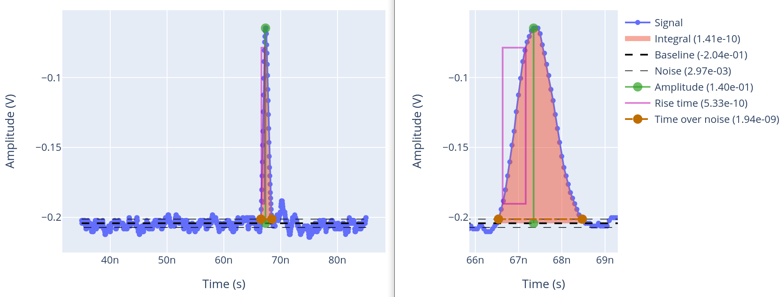

# signals

Package to ease the processing of signals.

## Installation

```
pip install git+https://github.com/SengerM/signals
```

## Usage

Simple example:

```Python
from signals.PeakSignal import PeakSignal, draw_in_plotly

pulse = PeakSignal(
	time = [3.5e-08, 3.505e-08, 3.51e-08, 3.515e-08, 3.5200000000000004e-08, 3.525e-08, 3.5300000000000005e-08, 3.535e-08, 3.54e-08, 3.545e-08, 3.55e-08, 3.5550000000000004e-08, 3.56e-08, 3.5650000000000005e-08, 3.57e-08, 3.575e-08, 3.58e-08, 3.585e-08, 3.5900000000000004e-08, 3.595e-08, 3.6000000000000005e-08, 3.605e-08, 3.61e-08, 3.615e-08, 3.62e-08, 3.6250000000000004e-08, 3.63e-08, 3.6350000000000005e-08, 3.64e-08, 3.6450000000000005e-08, 3.65e-08, 3.655e-08, 3.6600000000000003e-08, 3.665e-08, 3.6700000000000004e-08, 3.675e-08, 3.6800000000000005e-08, 3.685e-08, 3.69e-08, 3.695e-08, 3.7e-08, 3.7050000000000004e-08, 3.71e-08, 3.7150000000000005e-08, 3.72e-08, 3.725e-08, 3.73e-08, 3.735e-08, 3.7400000000000004e-08, 3.745e-08, 3.7500000000000005e-08, 3.755e-08, 3.7600000000000006e-08, 3.765e-08, 3.77e-08, 3.7750000000000004e-08, 3.78e-08, 3.7850000000000005e-08, 3.79e-08, 3.7950000000000006e-08, 3.8e-08, 3.805e-08, 3.8100000000000004e-08, 3.815e-08, 3.8200000000000005e-08, 3.825e-08, 3.8300000000000005e-08, 3.835e-08, 3.84e-08, 3.8450000000000004e-08, 3.85e-08, 3.8550000000000004e-08, 3.86e-08, 3.8650000000000005e-08, 3.87e-08, 3.875e-08, 3.8800000000000003e-08, 3.885e-08, 3.8900000000000004e-08, 3.895e-08, 3.9000000000000005e-08, 3.905e-08, 3.91e-08, 3.915e-08, 3.92e-08, 3.9250000000000004e-08, 3.93e-08, 3.9350000000000005e-08, 3.94e-08, 3.945e-08, 3.95e-08, 3.955e-08, 3.9600000000000004e-08, 3.965e-08, 3.9700000000000005e-08, 3.975e-08, 3.98e-08, 3.985e-08, 3.99e-08, 3.9950000000000004e-08, 4e-08, 4.0050000000000005e-08, 4.01e-08, 4.015e-08, 4.02e-08, 4.025e-08, 4.0300000000000004e-08, 4.035e-08, 4.0400000000000004e-08, 4.045e-08, 4.05e-08, 4.055e-08, 4.06e-08, 4.0650000000000003e-08, 4.07e-08, 4.0750000000000004e-08, 4.08e-08, 4.0850000000000005e-08, 4.09e-08, 4.0950000000000006e-08, 4.1e-08, 4.105e-08, 4.1100000000000004e-08, 4.115e-08, 4.1200000000000005e-08, 4.125e-08, 4.1300000000000006e-08, 4.135e-08, 4.14e-08, 4.1450000000000004e-08, 4.15e-08, 4.1550000000000005e-08, 4.16e-08, 4.1650000000000006e-08, 4.17e-08, 4.175e-08, 4.1800000000000004e-08, 4.185e-08, 4.1900000000000005e-08, 4.195e-08, 4.2000000000000006e-08, 4.205e-08, 4.21e-08, 4.2150000000000004e-08, 4.22e-08, 4.2250000000000004e-08, 4.23e-08, 4.2350000000000005e-08, 4.24e-08, 4.245e-08, 4.2500000000000003e-08, 4.255e-08, 4.2600000000000004e-08, 4.265e-08, 4.2700000000000005e-08, 4.275e-08, 4.28e-08, 4.285e-08, 4.29e-08, 4.2950000000000004e-08, 4.3e-08, 4.3050000000000005e-08, 4.31e-08, 4.315e-08, 4.32e-08, 4.325e-08, 4.3300000000000004e-08, 4.335e-08, 4.3400000000000005e-08, 4.345e-08, 4.35e-08, 4.355e-08, 4.36e-08, 4.3650000000000004e-08, 4.37e-08, 4.3750000000000005e-08, 4.38e-08, 4.385e-08, 4.39e-08, 4.3950000000000006e-08, 4.4000000000000004e-08, 4.405e-08, 4.4100000000000004e-08, 4.415e-08, 4.42e-08, 4.425e-08, 4.4300000000000006e-08, 4.4350000000000003e-08, 4.44e-08, 4.4450000000000004e-08, 4.45e-08, 4.455e-08, 4.46e-08, 4.4650000000000006e-08, 4.47e-08, 4.475e-08, 4.4800000000000004e-08, 4.485e-08, 4.49e-08, 4.495e-08, 4.5000000000000006e-08, 4.505e-08, 4.51e-08, 4.5150000000000004e-08, 4.52e-08, 4.5250000000000005e-08, 4.53e-08, 4.5350000000000006e-08, 4.54e-08, 4.545e-08, 4.5500000000000004e-08, 4.555e-08, 4.5600000000000005e-08, 4.565e-08, 4.5700000000000006e-08, 4.575e-08, 4.58e-08, 4.5850000000000004e-08, 4.59e-08, 4.5950000000000004e-08, 4.6e-08, 4.6050000000000005e-08, 4.61e-08, 4.615e-08, 4.6200000000000003e-08, 4.625e-08, 4.6300000000000004e-08, 4.635e-08, 4.6400000000000005e-08, 4.645e-08, 4.65e-08, 4.655e-08, 4.66e-08, 4.6650000000000004e-08, 4.67e-08, 4.6750000000000005e-08, 4.68e-08, 4.685e-08, 4.69e-08, 4.695e-08, 4.7000000000000004e-08, 4.705e-08, 4.7100000000000005e-08, 4.715e-08, 4.72e-08, 4.725e-08, 4.73e-08, 4.7350000000000004e-08, 4.74e-08, 4.7450000000000005e-08, 4.75e-08, 4.755e-08, 4.76e-08, 4.7650000000000006e-08, 4.7700000000000004e-08, 4.775e-08, 4.7800000000000005e-08, 4.785e-08, 4.79e-08, 4.795e-08, 4.8000000000000006e-08, 4.8050000000000003e-08, 4.81e-08, 4.8150000000000004e-08, 4.82e-08, 4.825e-08, 4.83e-08, 4.8350000000000006e-08, 4.84e-08, 4.845e-08, 4.8500000000000004e-08, 4.855e-08, 4.86e-08, 4.865e-08, 4.8700000000000006e-08, 4.875e-08, 4.88e-08, 4.8850000000000004e-08, 4.89e-08, 4.895e-08, 4.9e-08, 4.9050000000000006e-08, 4.91e-08, 4.915e-08, 4.9200000000000004e-08, 4.925e-08, 4.9300000000000005e-08, 4.935e-08, 4.9400000000000006e-08, 4.945e-08, 4.95e-08, 4.9550000000000004e-08, 4.96e-08, 4.9650000000000005e-08, 4.97e-08, 4.9750000000000005e-08, 4.98e-08, 4.985e-08, 4.9900000000000003e-08, 4.995000000000001e-08, 5e-08, 5.005e-08, 5.0100000000000005e-08, 5.015e-08, 5.02e-08, 5.025e-08, 5.030000000000001e-08, 5.035e-08, 5.04e-08, 5.0450000000000005e-08, 5.05e-08, 5.055e-08, 5.06e-08, 5.065000000000001e-08, 5.0700000000000004e-08, 5.075e-08, 5.0800000000000005e-08, 5.085e-08, 5.09e-08, 5.095e-08, 5.100000000000001e-08, 5.1050000000000004e-08, 5.11e-08, 5.1150000000000005e-08, 5.12e-08, 5.125e-08, 5.13e-08, 5.1350000000000007e-08, 5.1400000000000004e-08, 5.145e-08, 5.1500000000000005e-08, 5.155e-08, 5.16e-08, 5.165e-08, 5.1700000000000006e-08, 5.1750000000000003e-08, 5.18e-08, 5.1850000000000004e-08, 5.19e-08, 5.195e-08, 5.2e-08, 5.2050000000000006e-08, 5.21e-08, 5.215e-08, 5.2200000000000004e-08, 5.225e-08, 5.23e-08, 5.235e-08, 5.2400000000000006e-08, 5.245e-08, 5.25e-08, 5.2550000000000004e-08, 5.26e-08, 5.265e-08, 5.27e-08, 5.2750000000000006e-08, 5.28e-08, 5.285e-08, 5.2900000000000004e-08, 5.295e-08, 5.3e-08, 5.305e-08, 5.3100000000000006e-08, 5.315e-08, 5.32e-08, 5.3250000000000004e-08, 5.33e-08, 5.335e-08, 5.34e-08, 5.3450000000000005e-08, 5.35e-08, 5.355e-08, 5.3600000000000004e-08, 5.365000000000001e-08, 5.37e-08, 5.375e-08, 5.3800000000000005e-08, 5.385e-08, 5.39e-08, 5.3950000000000003e-08, 5.400000000000001e-08, 5.405e-08, 5.41e-08, 5.4150000000000005e-08, 5.42e-08, 5.425e-08, 5.43e-08, 5.435000000000001e-08, 5.44e-08, 5.445e-08, 5.4500000000000005e-08, 5.455e-08, 5.46e-08, 5.465e-08, 5.470000000000001e-08, 5.4750000000000004e-08, 5.48e-08, 5.4850000000000005e-08, 5.49e-08, 5.495e-08, 5.5e-08, 5.5050000000000007e-08, 5.5100000000000004e-08, 5.515e-08, 5.5200000000000005e-08, 5.525e-08, 5.53e-08, 5.535e-08, 5.5400000000000006e-08, 5.5450000000000004e-08, 5.55e-08, 5.5550000000000004e-08, 5.56e-08, 5.565e-08, 5.57e-08, 5.5750000000000006e-08, 5.5800000000000003e-08, 5.585e-08, 5.5900000000000004e-08, 5.595e-08, 5.6e-08, 5.605e-08, 5.6100000000000006e-08, 5.615e-08, 5.62e-08, 5.6250000000000004e-08, 5.63e-08, 5.635e-08, 5.64e-08, 5.6450000000000006e-08, 5.65e-08, 5.655e-08, 5.6600000000000004e-08, 5.665e-08, 5.67e-08, 5.675e-08, 5.6800000000000006e-08, 5.685e-08, 5.69e-08, 5.6950000000000004e-08, 5.7e-08, 5.705e-08, 5.71e-08, 5.7150000000000006e-08, 5.72e-08, 5.725e-08, 5.7300000000000004e-08, 5.735000000000001e-08, 5.74e-08, 5.745e-08, 5.7500000000000005e-08, 5.755e-08, 5.76e-08, 5.7650000000000003e-08, 5.770000000000001e-08, 5.775e-08, 5.78e-08, 5.7850000000000005e-08, 5.79e-08, 5.795e-08, 5.8e-08, 5.805000000000001e-08, 5.81e-08, 5.815e-08, 5.8200000000000005e-08, 5.825e-08, 5.83e-08, 5.835e-08, 5.840000000000001e-08, 5.8450000000000004e-08, 5.85e-08, 5.8550000000000005e-08, 5.86e-08, 5.865e-08, 5.87e-08, 5.8750000000000007e-08, 5.8800000000000004e-08, 5.885e-08, 5.8900000000000005e-08, 5.895e-08, 5.9e-08, 5.905e-08, 5.9100000000000006e-08, 5.9150000000000004e-08, 5.92e-08, 5.9250000000000004e-08, 5.93e-08, 5.935e-08, 5.94e-08, 5.9450000000000006e-08, 5.9500000000000003e-08, 5.955e-08, 5.9600000000000004e-08, 5.965000000000001e-08, 5.97e-08, 5.975e-08, 5.98e-08, 5.985e-08, 5.99e-08, 5.995e-08, 6.000000000000001e-08, 6.005e-08, 6.01e-08, 6.015e-08, 6.02e-08, 6.025e-08, 6.03e-08, 6.035000000000001e-08, 6.04e-08, 6.045e-08, 6.05e-08, 6.055e-08, 6.06e-08, 6.065e-08, 6.070000000000001e-08, 6.075e-08, 6.08e-08, 6.085e-08, 6.09e-08, 6.095e-08, 6.1e-08, 6.105000000000001e-08, 6.11e-08, 6.115e-08, 6.12e-08, 6.125e-08, 6.13e-08, 6.135e-08, 6.140000000000001e-08, 6.145e-08, 6.15e-08, 6.155e-08, 6.16e-08, 6.165e-08, 6.17e-08, 6.175000000000001e-08, 6.18e-08, 6.185e-08, 6.19e-08, 6.195e-08, 6.2e-08, 6.205e-08, 6.210000000000001e-08, 6.215000000000001e-08, 6.22e-08, 6.225e-08, 6.23e-08, 6.235e-08, 6.24e-08, 6.245000000000001e-08, 6.250000000000001e-08, 6.255e-08, 6.26e-08, 6.265e-08, 6.27e-08, 6.275e-08, 6.28e-08, 6.285000000000001e-08, 6.29e-08, 6.295e-08, 6.3e-08, 6.305e-08, 6.31e-08, 6.315e-08, 6.320000000000001e-08, 6.325e-08, 6.33e-08, 6.335e-08, 6.34e-08, 6.345e-08, 6.35e-08, 6.355000000000001e-08, 6.36e-08, 6.365e-08, 6.37e-08, 6.375e-08, 6.38e-08, 6.385e-08, 6.390000000000001e-08, 6.395e-08, 6.4e-08, 6.405e-08, 6.41e-08, 6.415e-08, 6.42e-08, 6.425000000000001e-08, 6.43e-08, 6.435e-08, 6.44e-08, 6.445e-08, 6.45e-08, 6.455e-08, 6.460000000000001e-08, 6.465e-08, 6.47e-08, 6.475e-08, 6.48e-08, 6.485e-08, 6.49e-08, 6.495000000000001e-08, 6.5e-08, 6.505e-08, 6.51e-08, 6.515e-08, 6.52e-08, 6.525e-08, 6.530000000000001e-08, 6.535e-08, 6.54e-08, 6.545e-08, 6.55e-08, 6.555e-08, 6.56e-08, 6.565000000000001e-08, 6.57e-08, 6.575e-08, 6.58e-08, 6.585e-08, 6.59e-08, 6.595e-08, 6.600000000000001e-08, 6.605e-08, 6.61e-08, 6.615e-08, 6.62e-08, 6.625e-08, 6.63e-08, 6.635000000000001e-08, 6.640000000000001e-08, 6.645e-08, 6.649999999999999e-08, 6.655e-08, 6.66e-08, 6.665e-08, 6.670000000000001e-08, 6.675000000000001e-08, 6.68e-08, 6.684999999999999e-08, 6.69e-08, 6.695e-08, 6.7e-08, 6.705000000000001e-08, 6.710000000000001e-08, 6.715e-08, 6.719999999999999e-08, 6.725e-08, 6.73e-08, 6.735e-08, 6.740000000000001e-08, 6.745000000000001e-08, 6.75e-08, 6.754999999999999e-08, 6.76e-08, 6.765e-08, 6.77e-08, 6.775000000000001e-08, 6.780000000000001e-08, 6.785e-08, 6.789999999999999e-08, 6.795e-08, 6.8e-08, 6.805e-08, 6.810000000000001e-08, 6.815000000000001e-08, 6.82e-08, 6.825e-08, 6.83e-08, 6.835e-08, 6.84e-08, 6.845000000000001e-08, 6.850000000000001e-08, 6.855e-08, 6.86e-08, 6.865e-08, 6.87e-08, 6.875e-08, 6.880000000000001e-08, 6.885000000000001e-08, 6.89e-08, 6.895e-08, 6.9e-08, 6.905e-08, 6.91e-08, 6.915000000000001e-08, 6.920000000000001e-08, 6.925e-08, 6.93e-08, 6.935e-08, 6.94e-08, 6.945e-08, 6.950000000000001e-08, 6.955000000000001e-08, 6.96e-08, 6.965e-08, 6.97e-08, 6.975e-08, 6.98e-08, 6.985000000000001e-08, 6.990000000000001e-08, 6.995e-08, 7e-08, 7.005e-08, 7.01e-08, 7.015e-08, 7.02e-08, 7.025000000000001e-08, 7.03e-08, 7.035e-08, 7.04e-08, 7.045e-08, 7.05e-08, 7.055e-08, 7.060000000000001e-08, 7.065e-08, 7.07e-08, 7.075e-08, 7.08e-08, 7.085e-08, 7.09e-08, 7.095000000000001e-08, 7.1e-08, 7.105e-08, 7.11e-08, 7.115e-08, 7.12e-08, 7.125e-08, 7.130000000000001e-08, 7.135e-08, 7.14e-08, 7.145e-08, 7.15e-08, 7.155e-08, 7.16e-08, 7.165000000000001e-08, 7.17e-08, 7.175e-08, 7.18e-08, 7.185e-08, 7.19e-08, 7.195e-08, 7.200000000000001e-08, 7.205e-08, 7.21e-08, 7.215e-08, 7.22e-08, 7.225e-08, 7.23e-08, 7.235000000000001e-08, 7.24e-08, 7.245e-08, 7.25e-08, 7.255e-08, 7.26e-08, 7.265e-08, 7.270000000000001e-08, 7.275e-08, 7.28e-08, 7.285e-08, 7.29e-08, 7.295e-08, 7.3e-08, 7.305000000000001e-08, 7.31e-08, 7.315e-08, 7.32e-08, 7.325e-08, 7.33e-08, 7.335e-08, 7.340000000000001e-08, 7.345e-08, 7.35e-08, 7.355e-08, 7.36e-08, 7.365e-08, 7.37e-08, 7.375000000000001e-08, 7.38e-08, 7.385e-08, 7.389999999999999e-08, 7.395e-08, 7.4e-08, 7.405e-08, 7.410000000000001e-08, 7.415000000000001e-08, 7.42e-08, 7.424999999999999e-08, 7.43e-08, 7.435e-08, 7.44e-08, 7.445000000000001e-08, 7.450000000000001e-08, 7.455e-08, 7.459999999999999e-08, 7.465e-08, 7.47e-08, 7.475e-08, 7.480000000000001e-08, 7.485000000000001e-08, 7.49e-08, 7.494999999999999e-08, 7.5e-08, 7.505e-08, 7.51e-08, 7.515000000000001e-08, 7.520000000000001e-08, 7.525e-08, 7.529999999999999e-08, 7.535e-08, 7.54e-08, 7.545e-08, 7.550000000000001e-08, 7.555000000000001e-08, 7.56e-08, 7.564999999999999e-08, 7.57e-08, 7.575e-08, 7.58e-08, 7.585000000000001e-08, 7.590000000000001e-08, 7.595e-08, 7.6e-08, 7.605e-08, 7.61e-08, 7.615e-08, 7.620000000000001e-08, 7.625000000000001e-08, 7.63e-08, 7.635e-08, 7.64e-08, 7.645e-08, 7.65e-08, 7.655000000000001e-08, 7.660000000000001e-08, 7.665e-08, 7.67e-08, 7.675e-08, 7.68e-08, 7.685e-08, 7.690000000000001e-08, 7.695000000000001e-08, 7.7e-08, 7.705e-08, 7.71e-08, 7.715e-08, 7.72e-08, 7.725000000000001e-08, 7.730000000000001e-08, 7.735e-08, 7.74e-08, 7.745e-08, 7.75e-08, 7.755e-08, 7.760000000000001e-08, 7.765000000000001e-08, 7.77e-08, 7.775e-08, 7.78e-08, 7.785e-08, 7.79e-08, 7.795e-08, 7.800000000000001e-08, 7.805e-08, 7.81e-08, 7.815e-08, 7.82e-08, 7.825e-08, 7.83e-08, 7.835000000000001e-08, 7.84e-08, 7.845e-08, 7.85e-08, 7.855e-08, 7.86e-08, 7.865e-08, 7.870000000000001e-08, 7.875e-08, 7.88e-08, 7.885e-08, 7.89e-08, 7.895e-08, 7.9e-08, 7.905000000000001e-08, 7.91e-08, 7.915e-08, 7.92e-08, 7.925e-08, 7.93e-08, 7.935e-08, 7.940000000000001e-08, 7.945e-08, 7.95e-08, 7.955e-08, 7.96e-08, 7.965e-08, 7.97e-08, 7.975000000000001e-08, 7.98e-08, 7.985e-08, 7.99e-08, 7.995e-08, 8e-08, 8.005e-08, 8.010000000000001e-08, 8.015e-08, 8.02e-08, 8.025e-08, 8.03e-08, 8.035e-08, 8.04e-08, 8.045000000000001e-08, 8.05e-08, 8.055e-08, 8.06e-08, 8.065e-08, 8.07e-08, 8.075e-08, 8.080000000000001e-08, 8.085e-08, 8.09e-08, 8.095e-08, 8.1e-08, 8.105e-08, 8.11e-08, 8.115000000000001e-08, 8.12e-08, 8.125e-08, 8.13e-08, 8.135e-08, 8.14e-08, 8.145e-08, 8.150000000000001e-08, 8.155000000000001e-08, 8.16e-08, 8.164999999999999e-08, 8.17e-08, 8.175e-08, 8.18e-08, 8.185000000000001e-08, 8.190000000000001e-08, 8.195e-08, 8.199999999999999e-08, 8.205e-08, 8.21e-08, 8.215e-08, 8.220000000000001e-08, 8.225000000000001e-08, 8.23e-08, 8.234999999999999e-08, 8.24e-08, 8.245e-08, 8.25e-08, 8.255000000000001e-08, 8.260000000000001e-08, 8.265e-08, 8.269999999999999e-08, 8.275e-08, 8.28e-08, 8.285e-08, 8.290000000000001e-08, 8.295000000000001e-08, 8.3e-08, 8.304999999999999e-08, 8.31e-08, 8.315e-08, 8.32e-08, 8.325000000000001e-08, 8.330000000000001e-08, 8.335e-08, 8.34e-08, 8.345e-08, 8.35e-08, 8.355e-08, 8.360000000000001e-08, 8.365000000000001e-08, 8.37e-08, 8.375e-08, 8.38e-08, 8.385e-08, 8.39e-08, 8.395000000000001e-08, 8.400000000000001e-08, 8.405e-08, 8.41e-08, 8.415e-08, 8.42e-08, 8.425e-08, 8.430000000000001e-08, 8.435000000000001e-08, 8.44e-08, 8.445e-08, 8.45e-08, 8.455e-08, 8.46e-08, 8.465000000000001e-08, 8.470000000000001e-08, 8.475e-08, 8.48e-08, 8.485e-08, 8.49e-08, 8.495e-08, 8.500000000000001e-08, 8.505000000000001e-08],
	samples = [-0.20240000000000002, -0.20440000000000003, -0.20240000000000002, -0.20240000000000002, -0.20240000000000002, -0.20240000000000002, -0.20440000000000003, -0.20440000000000003, -0.20440000000000003, -0.20240000000000002, -0.20240000000000002, -0.20240000000000002, -0.20240000000000002, -0.20440000000000003, -0.20640000000000003, -0.20840000000000003, -0.20840000000000003, -0.20840000000000003, -0.20640000000000003, -0.20640000000000003, -0.20440000000000003, -0.20440000000000003, -0.20240000000000002, -0.20440000000000003, -0.20440000000000003, -0.20640000000000003, -0.20640000000000003, -0.20640000000000003, -0.20440000000000003, -0.20440000000000003, -0.20440000000000003, -0.20640000000000003, -0.20640000000000003, -0.20840000000000003, -0.20840000000000003, -0.21040000000000003, -0.20840000000000003, -0.20840000000000003, -0.20840000000000003, -0.20840000000000003, -0.21040000000000003, -0.21040000000000003, -0.20840000000000003, -0.20640000000000003, -0.20640000000000003, -0.20440000000000003, -0.20440000000000003, -0.20440000000000003, -0.20240000000000002, -0.20440000000000003, -0.20640000000000003, -0.20840000000000003, -0.20840000000000003, -0.20440000000000003, -0.20240000000000002, -0.20240000000000002, -0.20240000000000002, -0.20440000000000003, -0.20440000000000003, -0.20440000000000003, -0.20640000000000003, -0.20640000000000003, -0.20640000000000003, -0.20640000000000003, -0.20440000000000003, -0.20440000000000003, -0.20440000000000003, -0.20440000000000003, -0.20640000000000003, -0.20640000000000003, -0.20640000000000003, -0.20640000000000003, -0.20440000000000003, -0.20440000000000003, -0.20240000000000002, -0.20440000000000003, -0.20640000000000003, -0.20840000000000003, -0.20840000000000003, -0.20840000000000003, -0.20840000000000003, -0.21040000000000003, -0.21240000000000003, -0.21240000000000003, -0.21240000000000003, -0.21040000000000003, -0.20840000000000003, -0.20840000000000003, -0.20840000000000003, -0.21040000000000003, -0.20840000000000003, -0.20840000000000003, -0.20840000000000003, -0.20840000000000003, -0.20840000000000003, -0.20640000000000003, -0.20640000000000003, -0.20640000000000003, -0.20840000000000003, -0.21040000000000003, -0.21040000000000003, -0.21040000000000003, -0.20840000000000003, -0.20640000000000003, -0.20640000000000003, -0.20440000000000003, -0.20440000000000003, -0.20440000000000003, -0.20440000000000003, -0.20440000000000003, -0.20440000000000003, -0.20440000000000003, -0.20440000000000003, -0.20440000000000003, -0.20440000000000003, -0.20440000000000003, -0.20240000000000002, -0.20240000000000002, -0.20440000000000003, -0.20440000000000003, -0.20840000000000003, -0.20840000000000003, -0.20840000000000003, -0.20640000000000003, -0.20640000000000003, -0.20640000000000003, -0.20640000000000003, -0.20640000000000003, -0.20440000000000003, -0.20440000000000003, -0.20240000000000002, -0.20240000000000002, -0.20440000000000003, -0.20440000000000003, -0.20440000000000003, -0.20440000000000003, -0.20440000000000003, -0.20440000000000003, -0.20440000000000003, -0.20440000000000003, -0.20440000000000003, -0.20440000000000003, -0.20440000000000003, -0.20440000000000003, -0.20440000000000003, -0.20440000000000003, -0.20640000000000003, -0.20640000000000003, -0.20840000000000003, -0.20840000000000003, -0.20840000000000003, -0.20640000000000003, -0.20640000000000003, -0.20640000000000003, -0.20640000000000003, -0.20640000000000003, -0.20640000000000003, -0.20840000000000003, -0.20840000000000003, -0.20840000000000003, -0.20840000000000003, -0.20640000000000003, -0.20640000000000003, -0.20640000000000003, -0.20640000000000003, -0.20440000000000003, -0.20240000000000002, -0.2004, -0.2004, -0.20240000000000002, -0.20440000000000003, -0.20640000000000003, -0.20440000000000003, -0.20440000000000003, -0.20440000000000003, -0.20440000000000003, -0.20440000000000003, -0.20440000000000003, -0.20440000000000003, -0.20440000000000003, -0.20440000000000003, -0.20440000000000003, -0.20440000000000003, -0.20440000000000003, -0.20440000000000003, -0.20440000000000003, -0.20440000000000003, -0.20440000000000003, -0.20440000000000003, -0.20440000000000003, -0.20440000000000003, -0.20640000000000003, -0.20440000000000003, -0.20240000000000002, -0.2004, -0.2004, -0.20240000000000002, -0.20640000000000003, -0.20840000000000003, -0.21040000000000003, -0.20840000000000003, -0.20840000000000003, -0.21040000000000003, -0.21240000000000003, -0.21240000000000003, -0.21040000000000003, -0.20840000000000003, -0.20840000000000003, -0.20840000000000003, -0.21040000000000003, -0.21040000000000003, -0.21040000000000003, -0.20640000000000003, -0.20640000000000003, -0.20640000000000003, -0.20840000000000003, -0.21040000000000003, -0.21040000000000003, -0.21040000000000003, -0.20840000000000003, -0.20840000000000003, -0.20640000000000003, -0.20640000000000003, -0.20640000000000003, -0.20640000000000003, -0.20640000000000003, -0.20640000000000003, -0.20440000000000003, -0.20440000000000003, -0.20240000000000002, -0.20440000000000003, -0.20440000000000003, -0.20440000000000003, -0.20440000000000003, -0.20440000000000003, -0.20640000000000003, -0.20840000000000003, -0.20840000000000003, -0.20840000000000003, -0.20840000000000003, -0.20840000000000003, -0.20840000000000003, -0.20840000000000003, -0.20840000000000003, -0.20640000000000003, -0.20640000000000003, -0.20640000000000003, -0.20640000000000003, -0.20840000000000003, -0.20840000000000003, -0.20640000000000003, -0.20640000000000003, -0.20440000000000003, -0.20440000000000003, -0.20440000000000003, -0.20440000000000003, -0.20440000000000003, -0.20440000000000003, -0.20240000000000002, -0.20240000000000002, -0.20240000000000002, -0.20240000000000002, -0.20240000000000002, -0.20240000000000002, -0.20240000000000002, -0.20440000000000003, -0.20440000000000003, -0.20640000000000003, -0.20440000000000003, -0.20240000000000002, -0.20240000000000002, -0.20440000000000003, -0.20440000000000003, -0.20440000000000003, -0.20240000000000002, -0.20240000000000002, -0.20240000000000002, -0.20440000000000003, -0.20440000000000003, -0.20440000000000003, -0.20640000000000003, -0.20840000000000003, -0.20840000000000003, -0.20840000000000003, -0.20640000000000003, -0.20440000000000003, -0.20640000000000003, -0.20640000000000003, -0.20640000000000003, -0.20440000000000003, -0.20240000000000002, -0.20240000000000002, -0.20440000000000003, -0.20440000000000003, -0.20240000000000002, -0.2004, -0.2004, -0.2004, -0.20240000000000002, -0.20240000000000002, -0.20240000000000002, -0.20240000000000002, -0.2004, -0.2004, -0.1984, -0.1984, -0.1984, -0.2004, -0.2004, -0.2004, -0.20240000000000002, -0.20440000000000003, -0.20440000000000003, -0.20640000000000003, -0.20640000000000003, -0.20640000000000003, -0.20640000000000003, -0.20440000000000003, -0.20440000000000003, -0.20440000000000003, -0.20440000000000003, -0.20440000000000003, -0.20440000000000003, -0.20440000000000003, -0.20440000000000003, -0.20640000000000003, -0.20640000000000003, -0.20640000000000003, -0.20440000000000003, -0.20240000000000002, -0.2004, -0.2004, -0.1984, -0.1984, -0.2004, -0.2004, -0.20240000000000002, -0.20240000000000002, -0.2004, -0.2004, -0.2004, -0.2004, -0.20240000000000002, -0.20440000000000003, -0.20440000000000003, -0.20240000000000002, -0.20240000000000002, -0.20240000000000002, -0.20240000000000002, -0.20240000000000002, -0.20240000000000002, -0.20240000000000002, -0.20240000000000002, -0.20240000000000002, -0.20240000000000002, -0.20240000000000002, -0.20440000000000003, -0.20440000000000003, -0.20640000000000003, -0.20840000000000003, -0.20840000000000003, -0.20840000000000003, -0.20640000000000003, -0.20440000000000003, -0.20240000000000002, -0.20440000000000003, -0.20440000000000003, -0.20440000000000003, -0.20240000000000002, -0.20240000000000002, -0.20240000000000002, -0.20440000000000003, -0.20440000000000003, -0.20440000000000003, -0.20440000000000003, -0.20640000000000003, -0.20840000000000003, -0.21040000000000003, -0.21040000000000003, -0.21040000000000003, -0.20840000000000003, -0.20640000000000003, -0.20640000000000003, -0.20640000000000003, -0.20840000000000003, -0.20840000000000003, -0.20840000000000003, -0.20640000000000003, -0.20440000000000003, -0.20440000000000003, -0.20440000000000003, -0.20640000000000003, -0.20840000000000003, -0.20840000000000003, -0.20840000000000003, -0.20640000000000003, -0.20640000000000003, -0.20840000000000003, -0.20840000000000003, -0.21040000000000003, -0.21040000000000003, -0.20840000000000003, -0.20640000000000003, -0.20640000000000003, -0.20640000000000003, -0.20840000000000003, -0.20840000000000003, -0.20840000000000003, -0.20840000000000003, -0.20640000000000003, -0.20440000000000003, -0.20640000000000003, -0.20640000000000003, -0.20640000000000003, -0.20640000000000003, -0.20640000000000003, -0.20440000000000003, -0.20240000000000002, -0.20240000000000002, -0.20240000000000002, -0.20440000000000003, -0.20440000000000003, -0.20440000000000003, -0.20440000000000003, -0.20440000000000003, -0.20240000000000002, -0.20240000000000002, -0.20240000000000002, -0.20240000000000002, -0.20240000000000002, -0.20240000000000002, -0.20240000000000002, -0.20440000000000003, -0.20440000000000003, -0.20440000000000003, -0.20440000000000003, -0.20440000000000003, -0.20640000000000003, -0.20840000000000003, -0.20840000000000003, -0.20840000000000003, -0.20840000000000003, -0.20640000000000003, -0.20440000000000003, -0.20240000000000002, -0.20240000000000002, -0.20440000000000003, -0.20440000000000003, -0.20640000000000003, -0.20440000000000003, -0.20440000000000003, -0.20440000000000003, -0.20440000000000003, -0.20440000000000003, -0.20440000000000003, -0.20440000000000003, -0.20440000000000003, -0.20240000000000002, -0.2004, -0.2004, -0.1984, -0.1984, -0.2004, -0.2004, -0.2004, -0.2004, -0.2004, -0.20240000000000002, -0.20240000000000002, -0.20240000000000002, -0.20240000000000002, -0.2004, -0.2004, -0.20240000000000002, -0.20240000000000002, -0.20440000000000003, -0.20440000000000003, -0.20440000000000003, -0.20440000000000003, -0.20440000000000003, -0.20640000000000003, -0.20640000000000003, -0.20840000000000003, -0.20840000000000003, -0.21040000000000003, -0.20840000000000003, -0.20640000000000003, -0.20440000000000003, -0.20440000000000003, -0.20640000000000003, -0.20840000000000003, -0.20840000000000003, -0.20840000000000003, -0.20640000000000003, -0.20640000000000003, -0.20640000000000003, -0.20840000000000003, -0.20640000000000003, -0.20640000000000003, -0.20640000000000003, -0.20440000000000003, -0.20440000000000003, -0.20440000000000003, -0.20440000000000003, -0.20640000000000003, -0.20640000000000003, -0.20440000000000003, -0.20440000000000003, -0.20440000000000003, -0.20440000000000003, -0.20440000000000003, -0.20440000000000003, -0.20240000000000002, -0.20240000000000002, -0.20440000000000003, -0.20440000000000003, -0.20440000000000003, -0.20440000000000003, -0.20240000000000002, -0.20440000000000003, -0.20440000000000003, -0.20440000000000003, -0.20440000000000003, -0.20640000000000003, -0.20640000000000003, -0.20840000000000003, -0.20840000000000003, -0.20640000000000003, -0.20640000000000003, -0.20440000000000003, -0.20640000000000003, -0.20840000000000003, -0.21040000000000003, -0.21040000000000003, -0.21040000000000003, -0.21040000000000003, -0.20840000000000003, -0.20640000000000003, -0.20640000000000003, -0.20440000000000003, -0.20440000000000003, -0.20640000000000003, -0.20840000000000003, -0.20840000000000003, -0.20640000000000003, -0.20440000000000003, -0.20440000000000003, -0.20440000000000003, -0.20240000000000002, -0.20240000000000002, -0.2004, -0.20240000000000002, -0.20240000000000002, -0.20240000000000002, -0.20240000000000002, -0.20240000000000002, -0.20240000000000002, -0.20240000000000002, -0.20440000000000003, -0.20440000000000003, -0.20440000000000003, -0.20240000000000002, -0.20240000000000002, -0.20240000000000002, -0.20440000000000003, -0.20240000000000002, -0.20240000000000002, -0.2004, -0.2004, -0.20240000000000002, -0.20240000000000002, -0.20240000000000002, -0.20240000000000002, -0.20240000000000002, -0.20240000000000002, -0.20240000000000002, -0.20240000000000002, -0.20240000000000002, -0.20240000000000002, -0.20240000000000002, -0.2004, -0.2004, -0.2004, -0.2004, -0.20240000000000002, -0.20640000000000003, -0.20840000000000003, -0.20840000000000003, -0.20640000000000003, -0.20240000000000002, -0.2004, -0.20240000000000002, -0.20440000000000003, -0.20440000000000003, -0.20440000000000003, -0.20240000000000002, -0.2004, -0.2004, -0.20240000000000002, -0.20440000000000003, -0.20440000000000003, -0.20240000000000002, -0.2004, -0.2004, -0.20240000000000002, -0.20240000000000002, -0.20440000000000003, -0.20440000000000003, -0.20440000000000003, -0.20440000000000003, -0.20240000000000002, -0.20240000000000002, -0.20240000000000002, -0.20440000000000003, -0.20640000000000003, -0.20840000000000003, -0.20840000000000003, -0.20840000000000003, -0.20640000000000003, -0.20840000000000003, -0.20840000000000003, -0.20840000000000003, -0.20640000000000003, -0.20640000000000003, -0.20840000000000003, -0.21040000000000003, -0.21040000000000003, -0.21040000000000003, -0.20840000000000003, -0.20640000000000003, -0.20440000000000003, -0.2004, -0.1944, -0.1884, -0.1804, -0.1704, -0.16040000000000001, -0.1484, -0.13840000000000002, -0.1244, -0.1124, -0.1004, -0.0884, -0.0804, -0.07440000000000001, -0.0704, -0.0664, -0.0644, -0.0644, -0.0644, -0.0684, -0.0764, -0.0824, -0.09040000000000001, -0.09840000000000002, -0.10840000000000001, -0.1164, -0.1264, -0.13640000000000002, -0.1464, -0.1564, -0.16440000000000002, -0.1704, -0.1764, -0.1824, -0.1864, -0.19039999999999999, -0.1944, -0.1984, -0.2004, -0.20240000000000002, -0.20440000000000003, -0.20440000000000003, -0.20440000000000003, -0.20640000000000003, -0.20640000000000003, -0.20640000000000003, -0.20440000000000003, -0.20640000000000003, -0.20640000000000003, -0.20640000000000003, -0.20640000000000003, -0.20240000000000002, -0.2004, -0.2004, -0.2004, -0.2004, -0.2004, -0.1984, -0.2004, -0.2004, -0.20240000000000002, -0.20240000000000002, -0.20240000000000002, -0.2004, -0.2004, -0.1984, -0.1984, -0.1984, -0.1964, -0.1964, -0.1924, -0.19039999999999999, -0.1884, -0.1884, -0.1884, -0.1884, -0.19039999999999999, -0.1924, -0.1944, -0.1964, -0.1964, -0.1964, -0.1964, -0.1964, -0.1964, -0.1984, -0.2004, -0.20240000000000002, -0.20240000000000002, -0.20240000000000002, -0.20240000000000002, -0.20240000000000002, -0.20440000000000003, -0.20640000000000003, -0.20640000000000003, -0.20640000000000003, -0.20640000000000003, -0.20840000000000003, -0.20840000000000003, -0.21040000000000003, -0.21240000000000003, -0.21240000000000003, -0.21240000000000003, -0.21240000000000003, -0.21040000000000003, -0.20840000000000003, -0.20640000000000003, -0.20640000000000003, -0.20640000000000003, -0.20440000000000003, -0.20240000000000002, -0.2004, -0.2004, -0.2004, -0.20240000000000002, -0.20240000000000002, -0.20240000000000002, -0.2004, -0.2004, -0.1984, -0.2004, -0.2004, -0.2004, -0.20240000000000002, -0.20240000000000002, -0.20240000000000002, -0.20240000000000002, -0.20440000000000003, -0.20440000000000003, -0.20640000000000003, -0.20640000000000003, -0.20640000000000003, -0.20640000000000003, -0.20840000000000003, -0.20840000000000003, -0.20840000000000003, -0.20840000000000003, -0.21040000000000003, -0.21040000000000003, -0.21240000000000003, -0.21240000000000003, -0.21040000000000003, -0.21040000000000003, -0.20840000000000003, -0.21040000000000003, -0.21040000000000003, -0.20840000000000003, -0.20840000000000003, -0.20840000000000003, -0.20840000000000003, -0.20840000000000003, -0.20840000000000003, -0.20840000000000003, -0.20640000000000003, -0.20640000000000003, -0.20840000000000003, -0.20840000000000003, -0.20840000000000003, -0.20640000000000003, -0.20840000000000003, -0.20840000000000003, -0.20840000000000003, -0.20840000000000003, -0.20640000000000003, -0.20640000000000003, -0.20640000000000003, -0.20840000000000003, -0.21040000000000003, -0.21240000000000003, -0.21440000000000003, -0.21440000000000003, -0.21440000000000003, -0.21440000000000003, -0.21240000000000003, -0.21240000000000003, -0.21240000000000003, -0.21240000000000003, -0.21240000000000003, -0.21240000000000003, -0.21040000000000003, -0.20840000000000003, -0.20840000000000003, -0.20640000000000003, -0.20640000000000003, -0.20840000000000003, -0.21040000000000003, -0.21040000000000003, -0.21040000000000003, -0.20840000000000003, -0.20640000000000003, -0.20440000000000003, -0.20440000000000003, -0.20440000000000003, -0.20440000000000003, -0.20640000000000003, -0.20840000000000003, -0.21040000000000003, -0.21040000000000003, -0.21040000000000003, -0.20840000000000003, -0.20840000000000003, -0.20840000000000003, -0.20840000000000003, -0.20840000000000003, -0.20840000000000003, -0.20640000000000003, -0.20440000000000003, -0.20240000000000002, -0.20440000000000003, -0.20640000000000003, -0.20640000000000003, -0.20640000000000003, -0.20640000000000003, -0.20440000000000003, -0.20440000000000003, -0.20440000000000003, -0.20240000000000002, -0.20240000000000002, -0.20240000000000002, -0.20240000000000002, -0.20240000000000002, -0.20240000000000002, -0.20240000000000002, -0.20240000000000002, -0.20440000000000003, -0.20440000000000003, -0.20440000000000003, -0.20640000000000003, -0.20840000000000003, -0.21040000000000003, -0.20840000000000003, -0.20840000000000003, -0.20640000000000003, -0.20640000000000003, -0.20640000000000003, -0.20640000000000003, -0.20640000000000003, -0.20640000000000003, -0.20640000000000003, -0.20640000000000003, -0.20640000000000003, -0.20640000000000003, -0.20440000000000003, -0.20440000000000003, -0.20440000000000003, -0.20440000000000003, -0.20440000000000003, -0.20440000000000003, -0.20240000000000002, -0.20240000000000002, -0.20240000000000002, -0.20240000000000002, -0.20440000000000003, -0.20640000000000003, -0.20640000000000003, -0.20640000000000003, -0.20440000000000003, -0.20440000000000003, -0.20440000000000003, -0.20640000000000003, -0.20840000000000003, -0.20840000000000003, -0.20840000000000003, -0.20640000000000003, -0.20640000000000003, -0.20640000000000003, -0.20640000000000003, -0.20840000000000003, -0.20840000000000003, -0.20640000000000003, -0.20440000000000003, -0.20440000000000003, -0.20440000000000003, -0.20640000000000003, -0.20840000000000003, -0.20840000000000003, -0.20840000000000003, -0.20840000000000003, -0.20840000000000003, -0.20840000000000003, -0.20840000000000003, -0.20840000000000003, -0.20640000000000003, -0.20640000000000003, -0.20640000000000003, -0.20640000000000003, -0.20640000000000003, -0.20640000000000003, -0.20440000000000003, -0.20440000000000003, -0.20440000000000003, -0.20440000000000003, -0.20640000000000003, -0.20640000000000003, -0.20640000000000003, -0.20640000000000003, -0.20840000000000003, -0.21040000000000003, -0.21240000000000003, -0.21040000000000003, -0.20840000000000003, -0.20640000000000003, -0.20640000000000003, -0.20840000000000003, -0.21040000000000003, -0.21040000000000003, -0.21040000000000003, -0.21040000000000003, -0.20840000000000003, -0.20440000000000003, -0.20240000000000002, -0.2004, -0.20240000000000002, -0.20240000000000002, -0.20240000000000002, -0.20440000000000003, -0.20440000000000003, -0.20440000000000003, -0.20440000000000003, -0.20440000000000003, -0.20440000000000003, -0.20440000000000003, -0.20240000000000002, -0.20240000000000002, -0.20240000000000002, -0.20240000000000002, -0.20440000000000003, -0.20240000000000002, -0.20440000000000003, -0.20440000000000003, -0.20840000000000003, -0.21040000000000003, -0.21040000000000003, -0.21040000000000003, -0.20840000000000003, -0.20840000000000003, -0.20640000000000003, -0.20840000000000003, -0.20840000000000003, -0.20840000000000003, -0.20840000000000003, -0.20840000000000003, -0.20840000000000003, -0.20640000000000003, -0.20440000000000003, -0.20440000000000003, -0.20640000000000003, -0.20640000000000003, -0.20840000000000003, -0.20840000000000003, -0.20840000000000003, -0.20840000000000003, -0.20840000000000003, -0.20640000000000003, -0.20440000000000003, -0.20440000000000003, -0.20440000000000003, -0.20640000000000003, -0.20640000000000003, -0.20640000000000003, -0.20440000000000003, -0.20240000000000002, -0.20240000000000002, -0.20240000000000002, -0.20440000000000003, -0.20440000000000003, -0.20440000000000003, -0.20440000000000003, -0.20240000000000002, -0.2004, -0.2004],
)
print(f'Amplitude = {pulse.amplitude}')
print(f'Noise = {pulse.noise}')
print(f'Integral = {pulse.peak_integral}')

fig = draw_in_plotly(pulse)
fig.update_layout(
	title = "My signal",
	xaxis_title = "Time (s)",
	yaxis_title = "Amplitude (V)",
)
fig.show()
fig.write_html('example.html', include_plotlyjs="cdn")
```

The previous code produces this plot:


